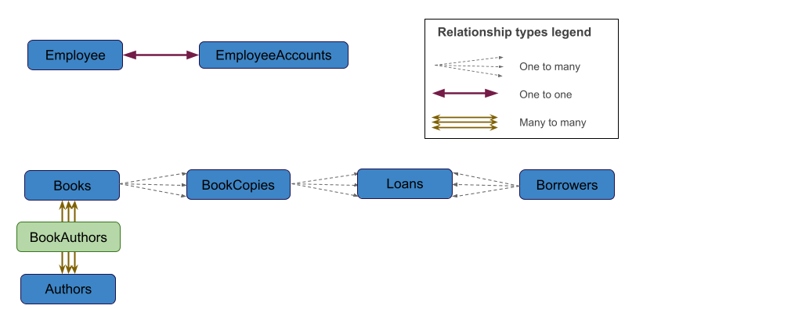
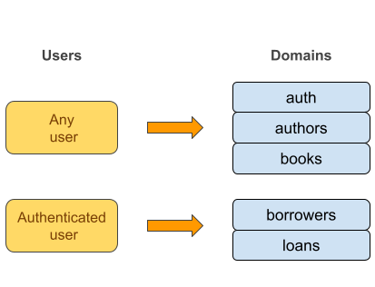

# library-system-app-fastapi

## Project description:

The project consists on a **FastAPI** app that mimics a basic library web service, and allows:
- Anonymous people to do basic queries about books and authors
- Employees to manage book loans and deal with book borrowers information.

## Project motivation:

The project was built to learn about how to implement auth and cache in a **FastAPI** context on **Python**, and get some basic understanding on how they work.

## Architecture Diagrams:

### High level diagram

  

Since employees need to use credentials in the request, **Caddy** was added to provide **HTTPS** connection between client and server , so  these credentials are sent in an encrypted form.

- Clients send **HTTPS** request to **Caddy**, which forwards a derived **HTTP** request to **FastAPI**.
- **FastAPI** runs a service related to the received request and generates a response. This service usually interacts directly with the **SQLite** database, but when possible, it avoids doing so by attempting to read precomputed answers in **Redis** cache.
- Once the service is run, **FastAPI** sends the response back to **Caddy**, which then uses **HTTPS** to send the encrypted response back to the client

## Database diagrams

The database can effectively be split into two diagrams. The first one, focuses on employees, and the second one, on the tables relevant to general users of the library app.

  

- Every employee has a a unique employee account, which is used for authentication and authorization
- Books and authors have a table describing their many to many relationship
- Each book  may have multiple physical copies to lend, so a separate table BookCopies was used.

## Endpoints overview:

Endpoints are organized in domains, each with their own router. Depending on the data the endpoints need to access, they will need the user to be authenticated or not.
 

  

- Basic queries on books and authors usually cache the answer if redis is available, and being completely up to date is not necessary.
- Pagination was added only on some endpoints where their response was expected to potentially include many elements. 
- Not all basic CRUD operations were included, just the ones that I considered relevant to the project’s goals.
- Authentication is needed to deal with databases that include personal information or perform actions that affect business operations.

## Setting up the app (in Windows):

- Download the project files
- Install Docker and Docker Desktop, and set up a Redis service within Docker using the following command on the terminal, on the main project folder while Docker Desktop is running

	`docker compose up -d`
	
- Change `.env.example`  filename to `.env` and change its values to include real variables( REDIS_PORT must match the one in `docker-compose.yml` ).
- Download a modern caddy executable file from an official, trusted website, and use it from the terminal with the `Caddyfile` (terminal must be on the main project folder)

	`<executable_file> run –config Caddyfile`
	
  where executable_file is the name of the downloaded caddy executable

- Create a python virtual env and install all relevant dependencies using `requirements.txt` .
- Activate this environment and change the terminal location into the project folder, from which all subsequent commands will be executed.
- Possibly, call the auxiliar scripts to populate the database with fake data:

	`python -m library_app.scripts.initialize_database`

	`python -m library_app.scripts.initialize_database2`
	
- Start the app:

	`uvicorn library_app.main:app --reload`

## More details
For a more pecise explanation of the decisions and choices, as well as future directions, see [Notes](technichal_overview.pdf).
